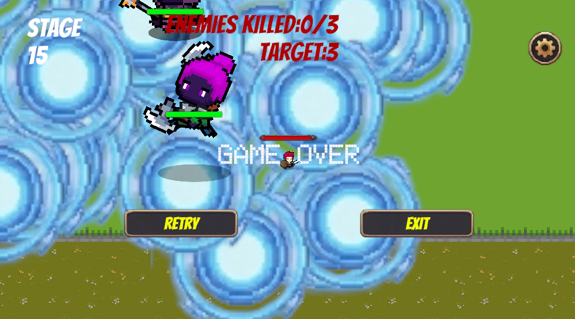
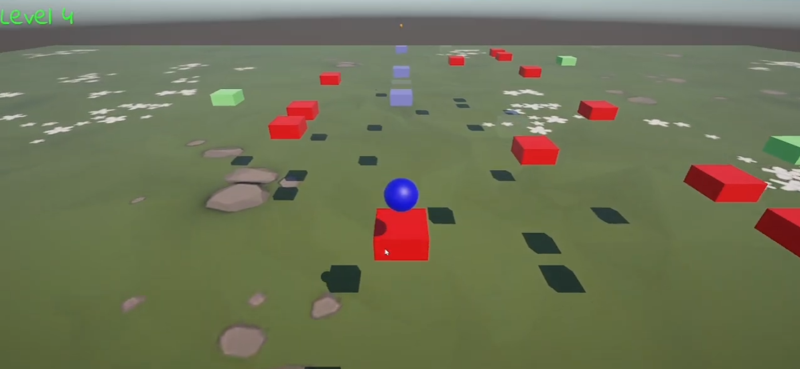

# Leo Huang

## About Me

Self-taught Unity developer with a complete Roguelike game shipped to WebGL and Android.

---

## Little Knight

*May 2026 – Present*

🎮 A 2D Roguelike action game built with Unity and C#.

**Features:**
- 15 levels of combat
- After each level, choose 1 buff from 3 random cards
- 10+ unique buffs: damage, attack speed, movement speed, health, thorns, lifesteal, on-hit heal, and more
- Class-based card pool: each class has its own set of available cards
- Build your own playstyle (attack speed + lifesteal, or thorns + on-hit heal)

**Technical Highlights:**
- ScriptableObject for card data
- Enum-based state machine for player
- A* pathfinding for enemy AI
- Object pooling for projectiles
- WebGL build playable in browser

🎮 [Play now](https://longsmoke1001.itch.io/little-knight) | 📺 [Gameplay](https://www.youtube.com/watch?v=VL8Eis9kCTU) | 💻 [GitHub](https://github.com/longsmoke1001/game-3-6.0)

---

## Ball Jump

*December 2025*

🎮 My first Unity project — a 3D platformer puzzle game.

**Features:**
- 8-direction movement with WASD
- Normal jump (1 tile) or **Shift jump** (2 tiles)
- 5 levels with increasing difficulty
- Platform mechanics: moving, disappearing, one-time-use, and unlockable platforms
- Players must find optimal routes to reach the goal
- Scene management for level progression

**Technical Highlights:**
- Singleton pattern for game state

This was my learning project while studying Unity and C#. Completed in 3 weeks.

🎮 [Play now](https://play.unity.com/en/games/950e66e8-d9e3-4c06-98db-629959d6e916/jumping-game) | 📺 [Gameplay](https://www.youtube.com/watch?v=8LkKMoMQjss) | 💻 [GitHub](https://github.com/longsmoke1001/Game)

---

## Skills

- **Languages**: C#
- **Engine**: Unity 6.0
- **Design Patterns**: Object Pool, Observer (Event/Action), Singleton, State Machine
- **Unity-Specific**: ScriptableObject, Coroutine, Animator
- **Algorithms**: A* pathfinding
- **Data**: JSON Serialization
- **Core Concepts**: OOP

---

## Contact

-[LinkedIn](https://www.linkedin.com/in/leo-huang-b294453aa/) 
-Email: leohuang[at]gmail.com
